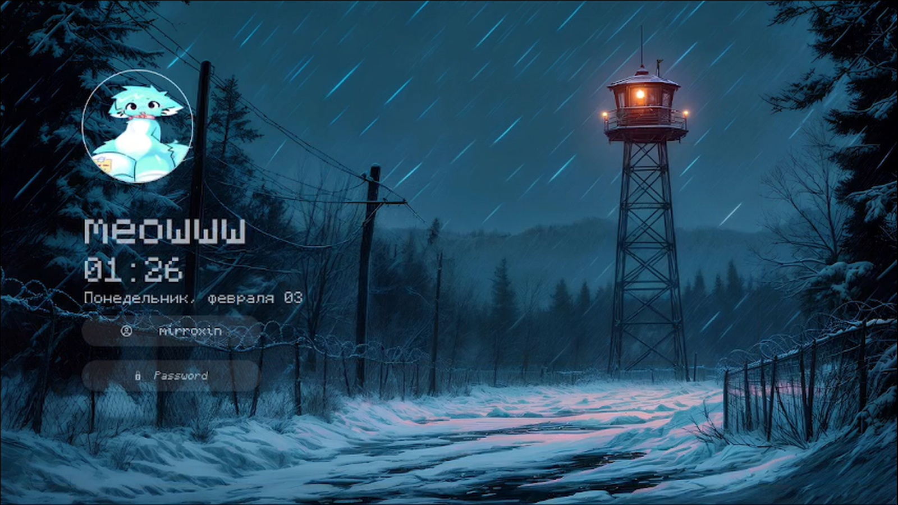
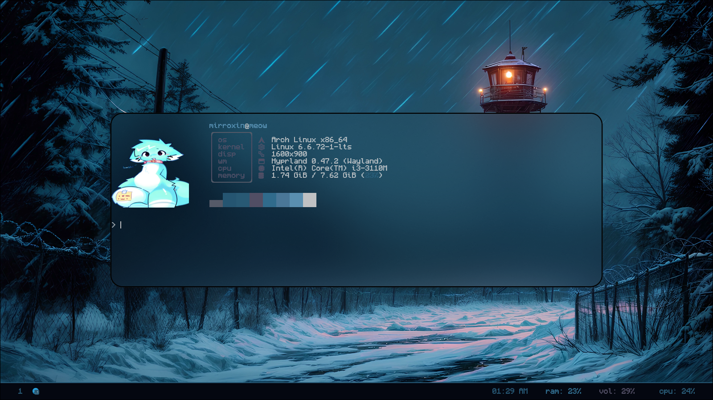
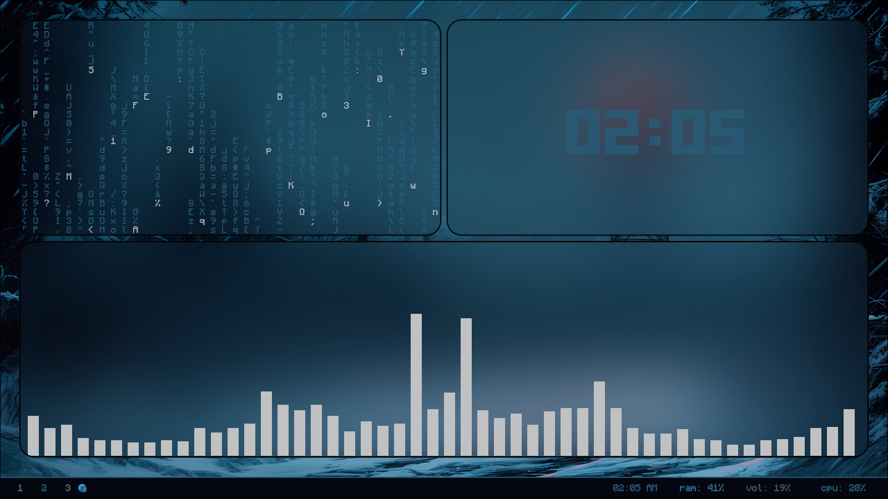
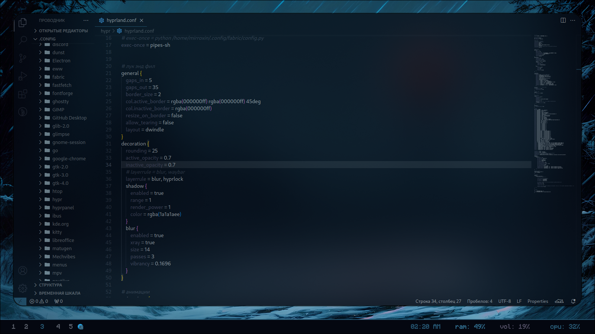
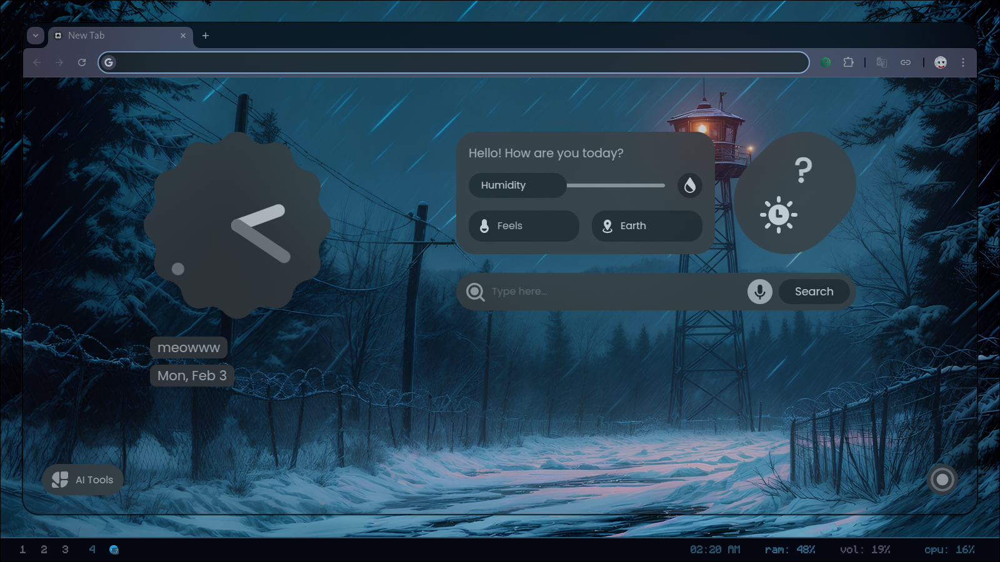
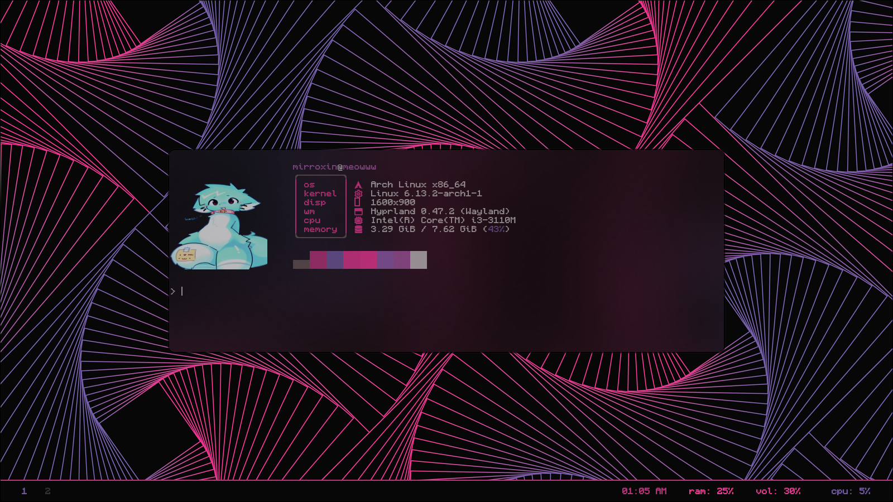
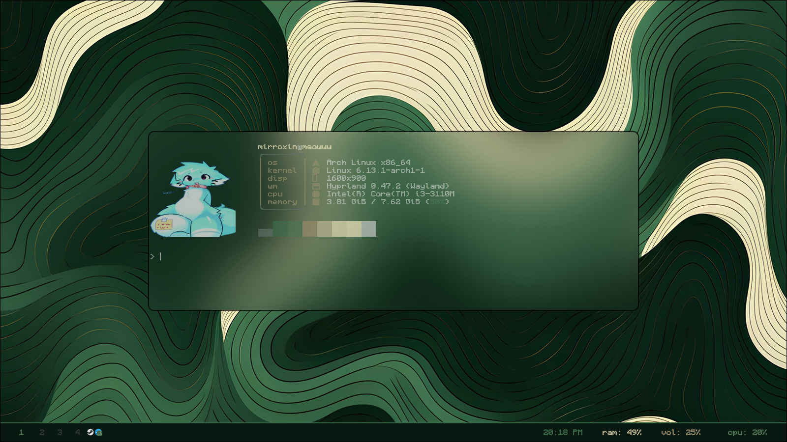
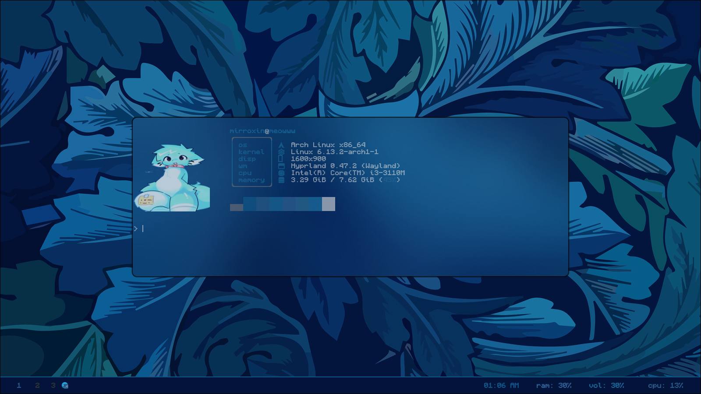

<p align="center">
  
</p>

<h1 align="center">🐱 Rampage</h1>

<p align="center">
  <b>my dotfiles but idk why did i do this</b>  
</p>

<p align="center">
  
  
  
</p>


 # **₍^. .^₎⟆ Screenshots**  
<details>
  <summary>My def setup</summary>
  
  
  
  
  
</details>


<p align="center">
  
  
  
</p>

---

## ₍^. .^₎⟆ Installing dependencies
Before you begin, make sure you have the following programs installed (arch):
```bash
sudo pacman -S waybar hyprlock kitty rofi fastfetch
yay -S swww pywal
```

## Clone my repository 
```bash
https://github.com/mirroxin/rampage
```

## Move my dots
```bash
mv ~/.config
mv ~.bashrc
```

## Download font
```bash
yay -S ttf-monocraft
```

