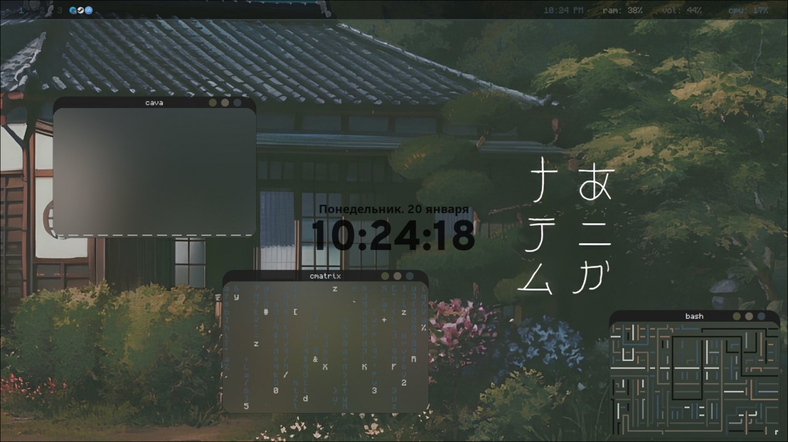
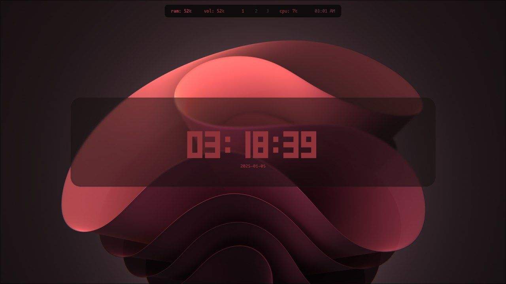
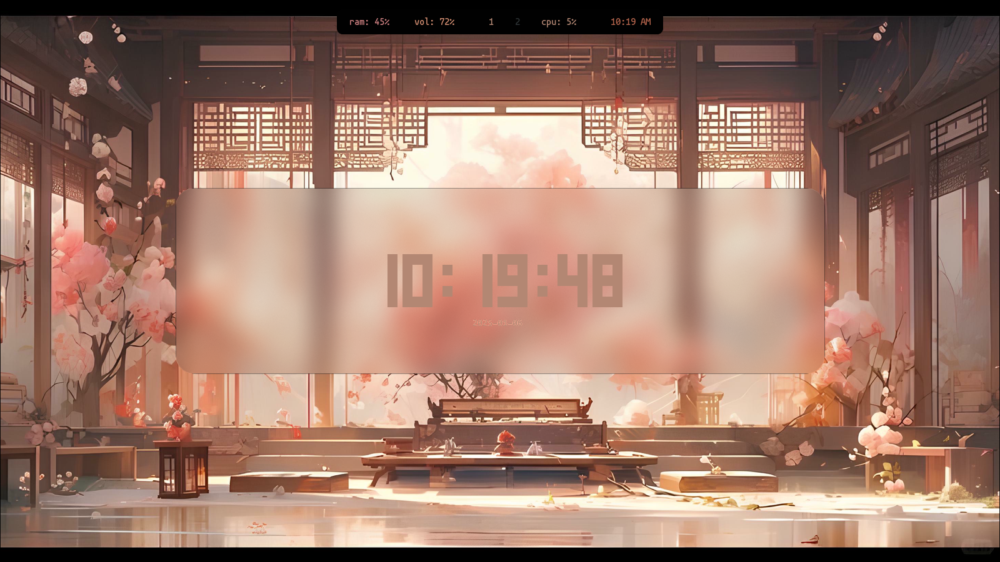

# Rampage
my dotfiles but idk why did i do this




## Installing dependencies
Before you begin, make sure you have the following programs installed (arch):
```
sudo pacman -S waybar hyprlock kitty rofi fastfetch
yay -S tty-clock swww fabric pywal
```
## clone my repository
```
git clone https://github.com/mirroxin/rampage 
```
## go there and copy the configuration
```
cd rampage
mv .config ~/
mv .bashrc ~/
```
## also don't forget to download this font
```
yay -S ttf-mononoki 
```
## Авторы
- [mirroxin](https://github.com/mirroxin) — Project Creator,
enjoy! :smile:
